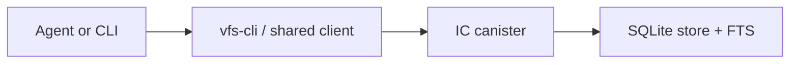
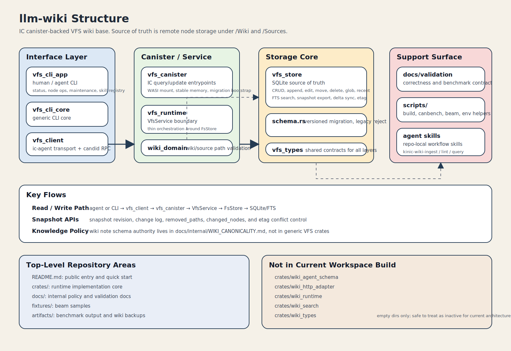

# llm-wiki

`llm-wiki` is an FS-first wiki and memory interface for coding agents.
It keeps remote nodes in an IC canister and exposes the same VFS through canister queries, a CLI, shared client library, and validation workflows.
It also includes a DB-backed Skill Knowledge Base for teams that want to find, evaluate, and grow agent skills from real task evidence.

## Architecture



Detailed structure map:



- Source of truth: remote `/Wiki/...` and `/Sources/...` nodes
- Conflict control: file-level `etag`
- Search: SQLite FTS on current node content
- Agent memory: task-scoped context, provenance, and local graph queries

## What Exists Today

- FS-first remote node API backed by the IC
- Rust CLI for direct path-based operations and sync flows
- Search, snapshot export, and delta sync
- Link graph and node-context queries for wiki navigation
- Agent Memory API v1 for canister-backed long-term context reads
- Skill Knowledge Base paths for private/team `SKILL.md` packages plus public catalog nodes
- Benchmark and validation workflows for VFS behavior

Current scope:

- single-tenant
- text-first
- `/Wiki/...` as the primary durable wiki root
- `/Sources/...` for raw and session source nodes

Storage constraints:

- User databases consume stable-memory mount IDs `11..=32767`, so one canister has 32757 lifetime database slots in v1.
- Archived or deleted databases clear their active mount ID, but v1 does not recycle historical mount IDs.
- Deleting, archiving, and restoring databases still consume cumulative lifetime mount IDs.
- See [`docs/DB_LIFECYCLE.md`](docs/DB_LIFECYCLE.md) for DB status, slot reuse, archive, and restore behavior.
- Link graph queries are backed by `fs_links`; SQLite size grows with stored link edges and two link indexes.
- Node writes update the link index in the same transaction as node content and FTS updates.

## Quick Start

### Workspace checks

```bash
cargo test --workspace
cargo clippy --workspace --all-targets -- -D warnings
```

### Local canister

```bash
bash scripts/build-vfs-canister.sh
icp network start -d
icp deploy -e local
```

If you need to install the Rust target manually first, use `rustup target add wasm32-wasip1`.

Resolve the target canister with one of:

- `--canister-id`
- `VFS_CANISTER_ID`
- `~/.config/vfs-cli/config.toml`
- `~/.vfs-cli.toml`

Minimal config:

```toml
canister_id = "aaaaa-aa"
```

Use `--local` to target the local replica. Otherwise the default host is `https://icp0.io`.

### Skill Knowledge Base

The fastest product path is the Skill KB quickstart:

```bash
CANISTER_ID=<canister-id> scripts/demo_skill_kb.sh
```

For a local replica:

```bash
CANISTER_ID=<canister-id> LOCAL=1 scripts/demo_skill_kb.sh
```

See [`docs/QUICKSTART_SKILL_KB.md`](docs/QUICKSTART_SKILL_KB.md) for the manual 5 minute flow.
The sample under [`examples/skill-kb`](examples/skill-kb) shows the intended loop: upload a skill package, find it from task context, inspect package files and evidence, record run evidence, then promote it.
The demo script can be rerun; if the database already exists, it links and continues.

DB-backed commands require `--database-id` or `VFS_DATABASE_ID`; no production `default` DB is created implicitly. Older single-DB commands such as `vfs-cli read-node --path /Wiki/index.md` must now select a DB:

```bash
cargo run -p vfs-cli -- --canister-id <canister-id> database create
cargo run -p vfs-cli -- --canister-id <canister-id> --database-id <database-id> write-node --path /Wiki/index.md --input index.md
cargo run -p vfs-cli -- --canister-id <canister-id> database grant <database-id> 2vxsx-fae reader
```

`database create` prints the generated DB ID. Use that ID for `--database-id` and grants. Public browser reads use the anonymous principal `2vxsx-fae`, so public DBs must grant that principal `reader`.

## Main Interfaces

### CLI

Use `vfs-cli` when working from a shell or script.
See [`docs/CLI.md`](docs/CLI.md) for flags, search preview modes, and examples.
See [`docs/SKILL_REGISTRY.md`](docs/SKILL_REGISTRY.md) for Skill Knowledge Base layout, manifest fields, database-role access, and Browser support.

Main commands:

- `rebuild-index`
- `rebuild-scope-index`
- `read-node`
- `read-node-context`
- `list-nodes`
- `write-node`
- `append-node`
- `edit-node`
- `delete-node`
- `delete-tree`
- `mkdir-node`
- `move-node`
- `glob-nodes`
- `recent-nodes`
- `graph-neighborhood`
- `graph-links`
- `incoming-links`
- `outgoing-links`
- `multi-edit-node`
- `search-remote`
- `search-path-remote`
- `lint-local`
- `status`
- `pull`
- `push`
- `skill upsert`
- `skill find`
- `skill inspect`
- `skill import github`
- `skill propose-improvement`
- `skill approve-proposal`
- `skill record-run`
- `skill set-status`
- `github ingest`

### Library Tool Calling

Use the shared Rust library when embedding VFS tool calling into an OpenAI-compatible client.
This is not shelling out to the CLI. It uses the same canister-backed VFS through the shared client and tool dispatcher.

```rust
use anyhow::Result;
use vfs_cli::agent_tools::{create_openai_tools, handle_openai_tool_call};
use vfs_client::CanisterVfsClient;

async fn run() -> Result<()> {
    let client = CanisterVfsClient::new(
        "http://127.0.0.1:8000",
        "aaaaa-aa",
    )
    .await?;

    let tools = create_openai_tools();

    // Pass `tools` into your OpenAI-compatible SDK request.
    // When the model returns a tool call:
    let result = handle_openai_tool_call(
        &client,
        "append",
        r#"{"path":"/Wiki/memory.md","content":"remember this"}"#,
    )
    .await?;

    println!("{}", result.text);
    Ok(())
}
```

Current tool names:

- `read`
- `read_context`
- `write`
- `append`
- `edit`
- `ls`
- `mkdir`
- `mv`
- `glob`
- `recent`
- `graph_neighborhood`
- `graph_links`
- `incoming_links`
- `outgoing_links`
- `multi_edit`
- `rm`
- `search`
- `search_paths`
- `skill_find`
- `skill_inspect`
- `skill_read`
- `skill_record_run`

Skill discovery and read tools are read-only runtime helpers.
Agents should call `skill_find` at task start, inspect promising candidates, read `SKILL.md` and package-local helper files, then apply those instructions to the current task.
They do not require shelling out to the CLI.
`skill_record_run` is a write tool for agent-side evidence capture and is excluded from read-only tool sets.
Use the CLI for operational writes such as `skill upsert`, `database link`, imports, and improvement proposal approval.

### Canister Agent Memory API

Use the read-only Agent Memory API when an agent talks directly to the canister rather than through CLI commands.

Primary methods:

- `memory_manifest`: discover roots, capabilities, limits, and memory API policy
- `query_context`: primary task-scoped context bundle with search hits, canonical pages, local graph, and optional evidence
- `source_evidence`: source-path evidence lookup for a known wiki node

Auxiliary methods:

- `read_node_context`
- `search_nodes`
- `search_node_paths`
- `graph_neighborhood`
- `recent_nodes`

`recent_changes` and `memory_summary` are not part of v1. Use `recent_nodes` for recent live nodes, and use `query_context` with a summary-style task for maintained overview context.

## Validation

The public validation docs live under `docs/validation/`.

- overview: [docs/validation/VFS_VALIDATION_PLAN.md](docs/validation/VFS_VALIDATION_PLAN.md)
- coverage matrix: [docs/validation/VFS_CORRECTNESS_CHECKLIST.md](docs/validation/VFS_CORRECTNESS_CHECKLIST.md)
- deployed canister benchmark contract: [docs/validation/VFS_DEPLOYED_CANISTER_BENCHMARKS.md](docs/validation/VFS_DEPLOYED_CANISTER_BENCHMARKS.md)

Minimum validation commands:

```bash
cargo test --workspace
bash scripts/build-vfs-canister-canbench.sh
```

If the fixed canbench runtime is available, also run:

```bash
bash scripts/run_canbench_guard.sh
```

## Repository Boundaries

- Public entry docs stay in English
- Validation docs describe VFS behavior, not product marketing
- Internal operating notes stay repo-local and are not part of the public entry path
- Historical or exploratory material is removed or archived instead of being linked from the README
