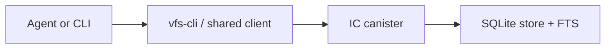

# llm-wiki

`llm-wiki` is an FS-first wiki for coding agents.
It keeps remote nodes in an IC canister and exposes the same VFS through a CLI, shared client library, and validation workflows.

## Architecture



Detailed structure map:


- Source of truth: remote `/Wiki/...` and `/Sources/...` nodes
- Conflict control: file-level `etag`
- Search: SQLite FTS on current node content

## What Exists Today

- FS-first remote node API backed by the IC
- Rust CLI for direct path-based operations and sync flows
- Search, snapshot export, and delta sync
- Link graph and node-context queries for wiki navigation
- Benchmark and validation workflows for VFS behavior

Current scope:

- single-tenant
- text-first
- `/Wiki/...` as the primary durable wiki root
- `/Sources/...` for raw and session source nodes

## Quick Start

### Workspace checks

```bash
cargo test --workspace
cargo clippy --workspace --all-targets -- -D warnings
```

### Local canister

```bash
bash scripts/build-vfs-canister.sh
icp network start -d
icp deploy -e local
```

If you need to install the Rust target manually first, use `rustup target add wasm32-wasip1`.

Resolve the target canister with one of:

- `--canister-id`
- `VFS_CANISTER_ID`
- `~/.config/vfs-cli/config.toml`
- `~/.vfs-cli.toml`

Minimal config:

```toml
canister_id = "aaaaa-aa"
```

Use `--local` to target the local replica. Otherwise the default host is `https://icp0.io`.

## Main Interfaces

### CLI

Use `vfs-cli` when working from a shell or script.
See [`docs/CLI.md`](docs/CLI.md) for flags, search preview modes, and examples.

Main commands:

- `rebuild-index`
- `rebuild-scope-index`
- `read-node`
- `read-node-context`
- `list-nodes`
- `write-node`
- `append-node`
- `edit-node`
- `delete-node`
- `delete-tree`
- `mkdir-node`
- `move-node`
- `glob-nodes`
- `recent-nodes`
- `graph-neighborhood`
- `graph-links`
- `incoming-links`
- `outgoing-links`
- `multi-edit-node`
- `search-remote`
- `search-path-remote`
- `lint-local`
- `status`
- `pull`
- `push`

### Library Tool Calling

Use the shared Rust library when embedding VFS tool calling into an OpenAI-compatible client.
This is not shelling out to the CLI. It uses the same canister-backed VFS through the shared client and tool dispatcher.

```rust
use anyhow::Result;
use vfs_cli::agent_tools::{create_openai_tools, handle_openai_tool_call};
use vfs_client::CanisterVfsClient;

async fn run() -> Result<()> {
    let client = CanisterVfsClient::new(
        "http://127.0.0.1:8000",
        "aaaaa-aa",
    )
    .await?;

    let tools = create_openai_tools();

    // Pass `tools` into your OpenAI-compatible SDK request.
    // When the model returns a tool call:
    let result = handle_openai_tool_call(
        &client,
        "append",
        r#"{"path":"/Wiki/memory.md","content":"remember this"}"#,
    )
    .await?;

    println!("{}", result.text);
    Ok(())
}
```

Current tool names:

- `read`
- `read_context`
- `write`
- `append`
- `edit`
- `ls`
- `mkdir`
- `mv`
- `glob`
- `recent`
- `graph_neighborhood`
- `graph_links`
- `incoming_links`
- `outgoing_links`
- `multi_edit`
- `rm`
- `search`
- `search_paths`

## Validation

The public validation docs live under `docs/validation/`.

- overview: [docs/validation/VFS_VALIDATION_PLAN.md](docs/validation/VFS_VALIDATION_PLAN.md)
- coverage matrix: [docs/validation/VFS_CORRECTNESS_CHECKLIST.md](docs/validation/VFS_CORRECTNESS_CHECKLIST.md)
- deployed canister benchmark contract: [docs/validation/VFS_DEPLOYED_CANISTER_BENCHMARKS.md](docs/validation/VFS_DEPLOYED_CANISTER_BENCHMARKS.md)

Minimum validation commands:

```bash
cargo test --workspace
bash scripts/build-vfs-canister-canbench.sh
```

If the fixed canbench runtime is available, also run:

```bash
bash scripts/run_canbench_guard.sh
```

## Repository Boundaries

- Public entry docs stay in English
- Validation docs describe VFS behavior, not product marketing
- Internal operating notes stay repo-local and are not part of the public entry path
- Historical or exploratory material is removed or archived instead of being linked from the README
