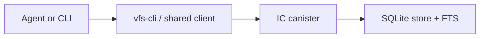

# llm-wiki

`llm-wiki` is an FS-first wiki for coding agents.
It keeps remote nodes in an IC canister and exposes the same VFS through a CLI, shared client library, and validation workflows.

## Architecture



- Source of truth: remote `/Wiki/...` and `/Sources/...` nodes
- Conflict control: file-level `etag`
- Search: SQLite FTS on current node content

## What Exists Today

- FS-first remote node API backed by the IC
- Rust CLI for direct path-based operations and sync flows
- Search, snapshot export, and delta sync
- Benchmark and validation workflows for VFS behavior

Current scope:

- single-tenant
- text-first
- `/Wiki/...` as the primary durable wiki root
- `/Sources/...` for raw and session source nodes

## Quick Start

### Workspace checks

```bash
cargo test --workspace
cargo clippy --workspace --all-targets -- -D warnings
```

### Local canister

```bash
rustup target add wasm32-unknown-unknown
icp network start -d
icp deploy -e local
```

Resolve the target canister with one of:

- `--canister-id`
- `VFS_CANISTER_ID`
- `~/.config/vfs-cli/config.toml`
- `~/.vfs-cli.toml`

Minimal config:

```toml
canister_id = "aaaaa-aa"
```

Use `--local` to target the local replica. Otherwise the default host is `https://icp0.io`.

## Main Interfaces

### CLI

Use `vfs-cli` when working from a shell or script.

Representative commands:

- `read-node`
- `write-node`
- `append-node`
- `edit-node`
- `list-nodes`
- `move-node`
- `delete-node`
- `search-remote`
- `search-path-remote`
- `pull`
- `push`
- `rebuild-index`

## Validation

The public validation docs live under `docs/validation/`.

- overview: [docs/validation/VFS_VALIDATION_PLAN.md](docs/validation/VFS_VALIDATION_PLAN.md)
- coverage matrix: [docs/validation/VFS_CORRECTNESS_CHECKLIST.md](docs/validation/VFS_CORRECTNESS_CHECKLIST.md)
- deployed canister benchmark contract: [docs/validation/VFS_DEPLOYED_CANISTER_BENCHMARKS.md](docs/validation/VFS_DEPLOYED_CANISTER_BENCHMARKS.md)

Minimum validation commands:

```bash
cargo test --workspace
bash scripts/build-vfs-canister-canbench.sh
```

If the fixed canbench runtime is available, also run:

```bash
bash scripts/run_canbench_guard.sh
```

## Repository Boundaries

- Public entry docs stay in English
- Validation docs describe VFS behavior, not product marketing
- Internal operating notes stay repo-local and are not part of the public entry path
- Historical or exploratory material is removed or archived instead of being linked from the README
