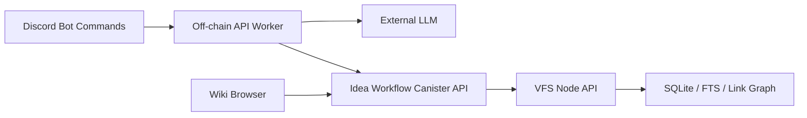

# Idea-to-Decision Wiki

この文書は、LLM-wiki を「アイデア投稿場所」ではなく「アイデアが意思決定へ育つ場所」として使うための Product Spec。

既存の VFS wiki は本文、検索、リンクグラフ、source evidence の基盤として使う。Idea-to-Decision 層は、その上に lifecycle、権限、承認、監査ログを追加する。

## Product Concept

目的は、雑なアイデアを流れるチャットのまま終わらせず、検証可能な知識と意思決定へ変換すること。

基本フロー:

1. ユーザーが Discord からアイデアを投稿する。
2. LLM が既存 wiki と照合する。
3. LLM が概要、課題、類似案、関連議論、反論、リスク、検証項目、次アクションを生成する。
4. 生成結果は `Draft` として保存される。
5. レビュアーが反論、補足、検証計画を追加する。
6. 権限者だけが `Canonical` へ昇格できる。
7. 関連する idea、problem、project、decision、open question に自動リンクされる。

LLM は整理、比較、抽出、論点更新を担う。正史化は行わない。Canonical 昇格は人間または明示権限を持つ principal の操作だけで発生する。

## Lifecycle

| State | 中身 | 権限 |
| --- | --- | --- |
| `Seed` | 投稿直後の雑メモ、未整理の仮説 | 投稿者、または小チームのみ |
| `Draft` | LLM が整理した初期ページ | チーム閲覧、投稿者編集 |
| `Review` | 反論、類似案、検証計画つき | レビュアー編集、チーム閲覧 |
| `Canonical` | 合意済みの知識、方針、決定 | 広く閲覧、編集は限定 |
| `Archive` | 棄却案、旧案、失敗記録 | 検索可能、編集不可 |

MVP は `Seed -> Draft -> Review -> Canonical -> Archive` を扱う。`Canonical` まで含めることで、単なるメモ管理ではなく意思決定 workflow として成立させる。

## Wiki Structure

推奨 root:

```text
/raw
  /discord
  /meetings
  /links
  /uploads

/wiki
  /ideas
  /problems
  /projects
  /decisions
  /people
  /organizations
  /open-questions

/meta
  schema.md
  permissions.md
  editorial-policy.md
  index.md
  log.md
```

役割:

- `/raw`: Discord 投稿、会議録、外部リンク、添付ファイルなどの raw source。
- `/wiki/ideas`: lifecycle を持つ idea page。
- `/wiki/problems`: 解決したい課題の整理。
- `/wiki/projects`: 実装・検証単位。
- `/wiki/decisions`: Canonical 化された意思決定。
- `/wiki/open-questions`: 未解決の問い、矛盾、検証待ち。
- `/meta/schema.md`: LLM と人間が従う page schema。
- `/meta/permissions.md`: lifecycle ごとの閲覧・編集・昇格権限。
- `/meta/editorial-policy.md`: claim、hypothesis、opinion の扱い。
- `/meta/log.md`: append-only の変更・昇格・archive log。

既存の repo-local note role では `/Sources/raw/...` と `/Wiki/...` が正本だが、この Product Spec では product-facing path として `/raw` と `/wiki` を使う。実装時は canister 内の実 path を `/Sources/raw/...` と `/Wiki/...` に正規化してもよい。

## Evidence Policy

Canonical 化の条件:

- `Claim`: 事実として扱う。source 必須。
- `Hypothesis`: 仮説として扱う。検証方法必須。
- `Opinion`: 個人またはチームの判断。署名必須。

禁止:

- source のない claim を Canonical に昇格する。
- 未解決の矛盾を settled fact として保存する。
- LLM の要約だけを根拠として decision を作る。
- raw transcript を canonical wiki content として重複保存する。

LLM は claim を生成できるが、source link と evidence span がない claim は `Review` で止める。`Canonical` では claim, hypothesis, opinion の区別が本文に残る必要がある。

## Discord Integration

初期 UX は Bot commands とする。自動チャンネル監視は v1 に含めない。ノイズ、誤取り込み、権限境界の曖昧化を避けるため。

Commands:

- `/idea submit`
  - Discord message、title、problem、raw notes、visibility を受け取る。
  - raw source を保存し、idea を `Seed` として作る。
- `/idea draft`
  - `Seed` を LLM に渡し、既存 wiki との照合結果を含む `Draft` を生成する。
- `/idea review`
  - 類似案、反論、リスク、検証項目、未解決問いを追加して `Review` に進める。
- `/idea canonicalize`
  - 権限者だけが実行できる。
  - 必須 evidence と reviewer approval を確認し、`Canonical` に昇格する。
- `/idea archive`
  - 棄却、重複、古い案を `Archive` に送る。

Slack や Web-only 投稿は後続候補。Slack は社内導入に強いが、初期 ICP / developer community との接続は Discord のほうが自然。Web-only は最小実装には向くが、実運用の会話から知識を育てる力が弱い。

## Runtime Architecture



責務:

- Discord Bot
  - slash command、Discord user identity、guild / channel context を受け取る。
  - Bot 自身は判断を持たず、API Worker に渡す。
- Off-chain API Worker
  - 外部 LLM を呼ぶ。
  - prompt、schema validation、source extraction、similarity query を担う。
  - canister へ workflow mutation を送る。
- Canister Workflow API
  - lifecycle state、permissions、approvals、audit log の正本。
  - LLM 生成物をそのまま信用せず、昇格条件を検証する。
- VFS Node API
  - 本文、raw source、検索、リンクグラフ、snapshot / sync を提供する。
- Wiki Browser
  - read-only viewer を土台に、後続で Idea dashboard、Review queue、Decision log を追加する。

LLM 実行は off-chain に置く。理由は、外部 LLM API、Discord token、rate limit、retry、prompt iteration を canister 内に押し込まないため。canister は workflow の正本と権限境界に集中する。

## Canister Workflow API

v1 から専用 API を追加する。既存 VFS node API だけで lifecycle を metadata に埋め込む設計は避ける。権限と監査が product value の中心だから、workflow は first-class にする。

必要な概念:

- `IdeaId`: idea の安定 ID。
- `IdeaState`: `Seed | Draft | Review | Canonical | Archive`。
- `Actor`: caller principal と外部 identity mapping。
- `ReviewerAction`: approve, request changes, reject, canonicalize, archive。
- `AuditEvent`: submit, draft generated, review updated, approval added, canonicalized, archived。
- `PermissionPolicy`: state ごとの read, edit, review, canonicalize, archive 権限。

API 方針:

- submit 系は raw source node と idea workflow record を同一操作で作る。
- draft / review 更新は `expected_version` または `expected_etag` を要求する。
- canonicalize は required evidence、reviewer approval、permission を検証する。
- archive は理由必須。
- audit log は append-only。

VFS node 側には Markdown 本文を保存する。Workflow record 側には state、owner、reviewers、source refs、current node path、audit pointer を保存する。検索と閲覧は VFS、権限と昇格は Workflow API が担当する。

## Page Shape

Idea page の最小構造:

```md
# <Idea Title>

## Status

- State:
- Owner:
- Reviewers:
- Visibility:
- Source:

## Summary

## Problem

## Proposed Approach

## Similar Ideas

## Related Discussions

## Claims

## Hypotheses

## Opinions

## Risks

## Validation Plan

## Next Actions

## Decision Log
```

Decision page の最小構造:

```md
# <Decision Title>

## Context

## Options Considered

## Decision

## Rationale

## Evidence

## Risks

## Reviewers

## Revisit Condition
```

## MVP Acceptance Criteria

Product:

- Discord から idea を投稿できる。
- LLM が既存 wiki と照合し、Draft を生成できる。
- Review で反論、類似案、検証項目、未解決問いを追加できる。
- 権限者だけが Canonical に昇格できる。
- Canonical decision が `/wiki/decisions` に残る。
- `Archive` された案も検索可能で、編集不可になる。

Safety:

- LLM だけでは Canonical 化できない。
- source のない claim は Canonical 化できない。
- audit log から、誰が投稿し、誰が review し、誰が昇格したか追える。
- Discord 自動監視なしでも運用できる。

Implementation:

- Bot / Worker / Canister / UI の責務が分かれている。
- 既存 VFS node API は本文、検索、リンクグラフ基盤として維持される。
- Workflow API は lifecycle と権限の正本になる。

## Non-Goals

- v1 では Discord channel watcher を作らない。
- v1 では Slack を第一接続にしない。
- v1 では LLM を canister 内で直接実行しない。
- v1 では汎用 wiki を目指さない。
- v1 では claim の真偽を自動判定しない。source と検証状態を管理する。

## Open Questions

- Discord identity と IC principal の mapping をどう確定するか。
- reviewer role を canister 内で固定管理するか、外部 role provider と同期するか。
- Canonical 昇格に必要な reviewer 数を固定値にするか、project ごとの policy にするか。
- private idea の暗号化を v1 に含めるか。
- Web UI の write 操作を Discord Bot と同時に提供するか。

## Recommended First Build

最初の build は `Discord Bot commands + Off-chain Worker + Workflow API + read-only dashboard` にする。

順序:

1. Workflow API の state / permission / audit model を追加する。
2. VFS node path convention と page templates を固定する。
3. Off-chain Worker で LLM draft generation を実装する。
4. Discord slash commands を接続する。
5. Browser に Idea dashboard、Review queue、Decision log を追加する。

この順序なら、知識の正本と権限境界を先に固めたうえで、Discord と LLM を安全に接続できる。
