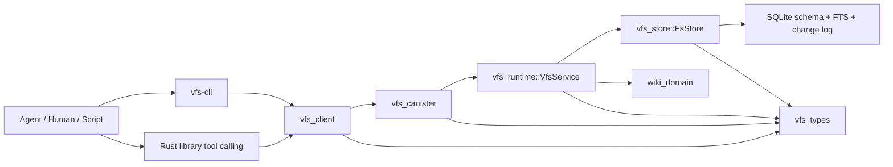
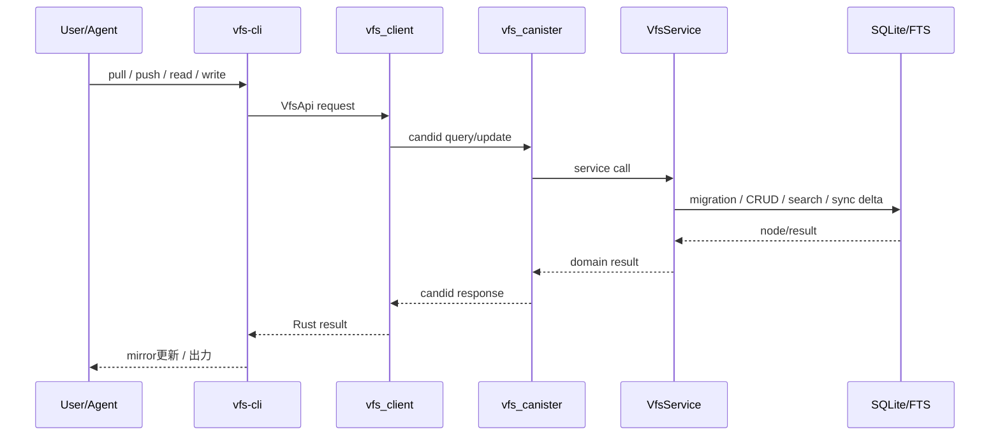

# llm-wiki 構造整理

## 1. 要約

`llm-wiki` は「IC canister 上の VFS を正本にした wiki 基盤」。
現行の主軸は Rust workspace 8 crate と、検証・運用・Obsidian 連携補助で構成される。
現在の中心概念は `/Wiki/...` と `/Sources/...` を同一 VFS 上で扱う FS-first 構成。

## 2. 全体像

## 3. トップレベル構成

| パス | 役割 | 補足 |
| --- | --- | --- |
| `README.md` | 公開入口 | 現行アーキテクチャ、CLI、検証導線 |
| `Cargo.toml` | workspace 定義 | 現行ビルド対象は 8 crate |
| `icp.yaml` | canister build 定義 | `scripts/build-vfs-canister.sh` を実行 |
| `crates/` | Rust 実装本体 | 現行 crate と空ディレクトリが混在 |
| `docs/` | 方針・検証資料 | `internal` と `validation` に分離 |
| `scripts/` | build / bench / canbench 補助 | Bash と Python 混在 |
| `fixtures/` | テスト・比較用固定入力 | mirror spec, beam sample |
| `artifacts/` | 生成物・測定結果保管 | 大容量データを含む |
| `plugins/kinic-wiki/` | Obsidian plugin | `main.js` と `node_modules` 同梱 |
| `.agents/skills/` | Codex/agent 向け skill | ingest / lint / query |
| `.benchmarks/`, `.canbench*` | bench 関連補助 | 実行補助と結果置き場 |
| `.wiki/` | repo-local wiki 領域 | 現状調査対象外、補助用途 |
| `target/` | Rust build 生成物 | 派生物、正本ではない |

## 4. 現行 workspace crate

`Cargo.toml` 上の現行メンバーは次の 8 個。

| crate | 役割 | 主要ファイル |
| --- | --- | --- |
| `vfs_canister` | ICP 公開入口 | `src/lib.rs`, `vfs.did` |
| `vfs_cli_app` | agent / human 向け CLI 本体 | `src/main.rs`, `src/commands.rs`, `src/mirror.rs` |
| `vfs_cli_core` | CLI 共通核 | `src/cli.rs`, `src/commands.rs`, `src/agent_tools.rs` |
| `vfs_client` | canister RPC client | `src/lib.rs` |
| `vfs_runtime` | service 境界 | `src/lib.rs` |
| `vfs_store` | SQLite / FTS / sync / migration | `src/fs_store.rs`, `src/fs_search.rs`, `src/schema.rs` |
| `vfs_types` | 共通型 | `src/fs.rs`, `src/lib.rs` |
| `wiki_domain` | wiki 固有 path policy | `src/lib.rs` |

## 5. crate 依存と責務分離

### 5.1 `vfs_types`

- 全層共通の request / response / node 型を保持
- `Status` を含む公開 API 契約面
- wiki 固有ロジックを持たない

### 5.2 `wiki_domain`

- `/Wiki/...` と `/Sources/raw/...`, `/Sources/sessions/...` の path policy を集中管理
- source node の canonical path 制約を強制
- mirror root 既定値など、wiki だけが知る規則を保持

### 5.3 `vfs_store`

- SQLite 正本層
- CRUD、move、append、multi edit、glob、recent、FTS search、snapshot export、delta sync を集約
- `schema.rs` で versioned migration を適用
- `fs_change_log` と `fs_path_state` により sync 差分を計算
- FTS preview 生成は ranking と分離して性能劣化を抑制

主要ファイル:

- `fs_store.rs`: 永続化 API 本体
- `fs_search.rs`: FTS 検索計画、候補再ランク
- `schema.rs`: migration 管理
- `glob_match.rs`: glob 判定
- `hashing.rs`: etag 用ハッシュ補助
- `fs_helpers.rs`: path 正規化、row→domain 変換

### 5.4 `vfs_runtime`

- `FsStore` を包む薄い service 層
- canister と他の呼び出し元から同一境界で利用
- `wiki_domain` の validation を保存前に再適用

### 5.5 `vfs_canister`

- IC query/update entrypoint 群
- WASI + stable structures 上に SQLite ファイルを mount
- 初期化時に migration 実行
- canister 境界は薄く保ち、実ロジックは `VfsService` に委譲

公開メソッド群:

- `status`
- `read_node`, `list_nodes`
- `write_node`, `append_node`, `edit_node`, `delete_node`, `move_node`
- `mkdir_node`, `glob_nodes`, `recent_nodes`, `multi_edit_node`
- `search_nodes`, `search_node_paths`
- `export_snapshot`, `fetch_updates`

### 5.6 `vfs_client`

- `ic-agent` を使う Rust client
- query / update の Candid encode/decode を共通化
- CLI と library embedding の共通 transport

### 5.7 `vfs_cli_core`

- generic VFS CLI 層
- CLI 引数定義、connection 解決、共通コマンド、tool schema を保持
- wiki 固有の mirror workflow は持たない

### 5.8 `vfs_cli_app`

- 実運用向け CLI 本体
- `pull` / `push` による local mirror 同期
- `lint-local`, `status`, index 再構築を提供
- `agent_tools.rs` で OpenAI 互換 tool calling 用 schema と dispatcher を提供

主要ソース:

- `cli.rs`: CLI 定義
- `commands.rs`: dispatch と pull/push
- `mirror.rs`: mirror state 管理、差分反映、conflict file 出力
- `maintenance.rs`: index 再構築
- `lint_local.rs`: mirror lint
- `mirror_frontmatter.rs`: mirror frontmatter 補助

## 6. 同期と保存の流れ

## 7. データ設計上の要点

- 正本は remote VFS node
- storage と search は同じ SQLite に集約
- 更新と検索 index 更新は同一 transaction 前提
- conflict 制御は file-level `etag`
- migration は versioned で 1 回だけ適用
- legacy schema 自動吸収は行わず、再作成を要求

## 8. docs / scripts / fixtures / artifacts

### 8.1 `docs/`

| パス | 内容 |
| --- | --- |
| `docs/internal/WIKI_CANONICALITY.md` | wiki note 正本規約 |
| `docs/validation/VFS_VALIDATION_PLAN.md` | 検証全体像 |
| `docs/validation/VFS_CORRECTNESS_CHECKLIST.md` | VFS correctness 観点 |
| `docs/validation/VFS_DEPLOYED_CANISTER_BENCHMARKS.md` | bench 契約 |
| `docs/archive/idea.md` | 退避済み草案 |

### 8.2 `scripts/`

| 系統 | 主要ファイル | 内容 |
| --- | --- | --- |
| build | `build-vfs-canister.sh`, `build-vfs-canister-canbench.sh` | canister build |
| canbench | `run_canbench_guard.sh`, `run_canbench_scale.sh`, `canbench/*.py` | canbench 集計・比較 |
| bench | `bench/run_beam_bench.sh`, `bench/run_canister_vfs_*.sh` | beam / canister workload |
| env | `wasi-env.sh`, `setup_canbench_ci.sh` | 実行環境補助 |

### 8.3 `fixtures/`

- `fixtures/mirror_spec/`: mirror golden と system page 定義
- `fixtures/beam/`: beam sample 入力

### 8.4 `artifacts/`

- `artifacts/beam/`: 大規模 beam データ
- `artifacts/beam-runs/`: 実行結果置き場
- `artifacts/manual-scoring/`: 手動評価補助
- `artifacts/wiki-backups/`: wiki backup metadata

## 9. agent / editor 連携

### 9.1 `.agents/skills/`

| skill | 用途 |
| --- | --- |
| `kinic-wiki-ingest` | raw source を `/Sources/raw/...` に取り込み、review-ready まで整形 |
| `kinic-wiki-lint` | wiki health 点検 |
| `kinic-wiki-query` | knowledge base query |

### 9.2 `plugins/kinic-wiki/`

- Obsidian plugin 実装
- `main.js` から replica host, canister ID, mirror root, auto pull を設定
- vault を canister-backed wiki mirror と同期する用途
- `node_modules/` 同梱のためディレクトリ規模は大きい

## 10. 現行ビルド対象外

`crates/wiki_agent_schema`, `crates/wiki_http_adapter`, `crates/wiki_runtime`, `crates/wiki_search`, `crates/wiki_types` はディレクトリだけ存在し、現時点でファイル実体も workspace 参加もない。

解釈:

- 旧設計名の残骸、または将来用プレースホルダの可能性
- 現行構造理解では「依存対象外」「ビルド対象外」として扱うのが安全

## 11. 初見読解順

1. `README.md`
2. `Cargo.toml`
3. `crates/vfs_types/src/lib.rs`
4. `crates/wiki_domain/src/lib.rs`
5. `crates/vfs_store/src/fs_store.rs`
6. `crates/vfs_runtime/src/lib.rs`
7. `crates/vfs_canister/src/lib.rs`
8. `crates/vfs_cli_app/src/commands.rs`
9. `docs/internal/WIKI_CANONICALITY.md`
10. `docs/validation/VFS_VALIDATION_PLAN.md`

## 12. 実務上の見取り図

- product 中核: `vfs_canister` + `vfs_runtime` + `vfs_store`
- 利用面中核: `vfs_client` + `vfs_cli_core` + `vfs_cli_app`
- wiki 固有規約: `wiki_domain` + `docs/internal/WIKI_CANONICALITY.md`
- 品質担保: `tests`, `docs/validation`, `scripts/canbench`, `scripts/bench`
- 周辺連携: `.agents/skills`, `plugins/kinic-wiki`

現状の repo は「wiki アプリ」より「wiki 用 VFS 基盤 + 運用補助一式」と読むのが最も正確。
