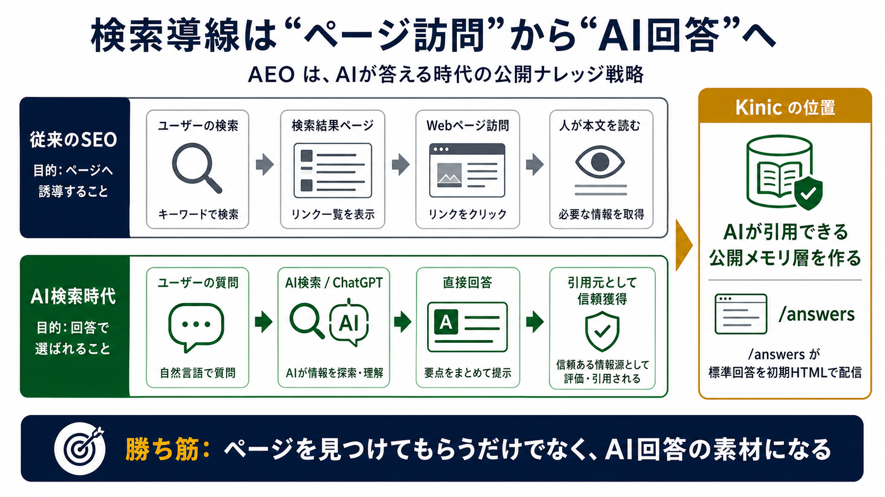
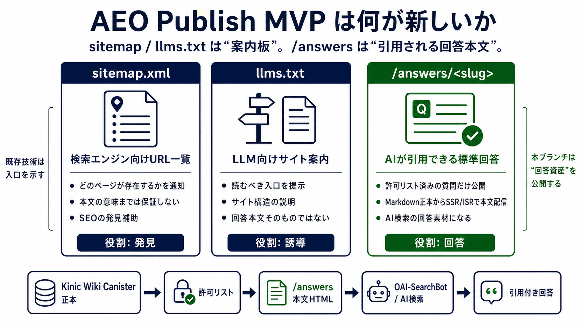
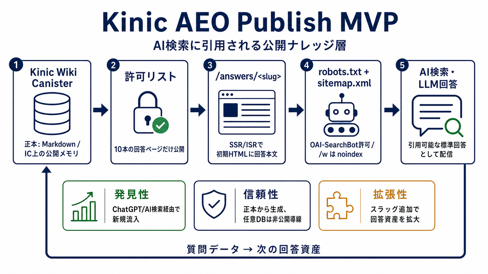

# AEO Publish MVP Investor Diagrams

投資家向けに AEO Publish MVP の概念を説明する図を置く。

## 推奨順序

1. 
   検索導線が「ページ訪問」から「AI回答」へ移る市場変化を示す。

2. 
   `sitemap.xml`、`llms.txt`、`/answers/<slug>` の役割差を示す。

3. 
   Kinic Wiki Canister から AI 検索に引用されるまでの公開フローを示す。
